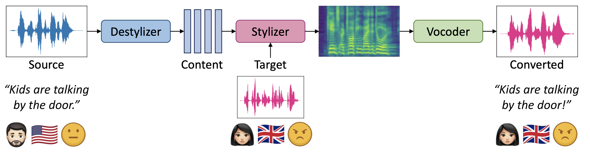

<h1 align="center">
  StyleStream
</h1>

<p align="center">
  <a href="http://arxiv.org/abs/2602.20113"></a>
  <a href="https://berkeley-speech-group.github.io/StyleStream/"></a>
  <a href="https://huggingface.co/Louis0324/StyleStream"></a>
  <a href="./LICENSE"></a>
</p>

<p align="center">
  <strong>StyleStream: Real-Time Zero-Shot Voice Style Conversion</strong>
</p>

<p align="center">
  Official PyTorch inference code for streamable voice style conversion in timbre, accent, and emotion.
</p>

<p align="center">
  
</p>

**Release note:** To reduce voice-cloning misuse, this public release excludes the style encoder weights. Public inference uses curated target speaker embeddings from [Hugging Face](https://huggingface.co/Louis0324/StyleStream), not arbitrary target-speaker cloning.

## News

- 2026/06/11: StyleStream offline / streaming inference code and weights are open sourced! 🔥 🔥 🔥
- 2026/06/03: StyleStream was accepted to the INTERSPEECH 2026 long paper track! 🎉 🎉 🎉

## Setup

Create and activate a Python environment. The project has been tested with a conda environment:

```bash
conda create -n stylestream python=3.12
conda activate stylestream
```

On macOS or Linux, install PortAudio before installing Python dependencies:

```bash
conda install -c conda-forge portaudio
```

Then install the Python packages:

```bash
pip install -r requirements.txt
```

`requirements.txt` installs CUDA PyTorch wheels on Windows/Linux and standard PyTorch wheels on macOS. The realtime apps use PyAudio, so the machine running them must have usable local audio input/output devices.

## Checkpoints

From the project root, download the public checkpoints from Hugging Face:

```bash
hf download Louis0324/StyleStream \
  stylizer-no-style-enc.ckpt destylizer.ckpt vocos_causal_best.ckpt \
  --repo-type model --local-dir assets/ckpts
```

The expected checkpoint files are:

- `assets/ckpts/stylizer-no-style-enc.ckpt`
- `assets/ckpts/destylizer.ckpt`
- `assets/ckpts/vocos_causal_best.ckpt`

If you run the download command from another directory, move the checkpoint files into `assets/ckpts/` before running inference.

The public stylizer checkpoint does not include style encoder weights. Target styles must come from folders containing both a `.wav` file and a matching `.npy` style embedding.

## Style Inventory

StyleStream uses target style packages with this format:

```text
assets/target_examples/british/
  british.wav
  british.npy
```

The `.wav` provides target mel/acoustic context. The `.npy` file is the pre-extracted style embedding with shape `[768]`.

Small example styles are included under `assets/target_examples/`.

A larger target speaker inventory is available from Hugging Face:

```bash
hf download Louis0324/StyleStream target_spkrs.tar --repo-type model --local-dir assets/target_spkrs
```

Keep the file at `assets/target_spkrs/target_spkrs.tar`. The Streamlit app indexes this tar file directly and lazily extracts only the selected `.wav` or `.wav`/`.npy` pair into `.cache/`.

## Offline Inference

### Streamlit App

```bash
streamlit run inference/offline_app.py
```

Use local assets, `target_spkrs.tar`, or microphone recording as source audio. Targets must be style folders or tar entries with both `.wav` and `.npy`.

### Notebook

Use `inference/inference.ipynb` for quick interactive conversion.

### Command Line

```bash
./inference/run_inference_offline.sh
```

### Python API

```python
import sys

import soundfile as sf
import torch

from stylizer.cfm_lightning_module import CFMLightningModule

if sys.platform == "darwin" and torch.backends.mps.is_available():
    device = "mps"
elif torch.cuda.is_available():
    device = "cuda"
else:
    device = "cpu"

model = CFMLightningModule.load_for_inference(
    "./assets/ckpts/stylizer-no-style-enc.ckpt",
    device=device,
)

out = model.sample(
    content="assets/target_examples/source.wav",
    cond="assets/target_examples/british",
    steps=16,
    cfg_strength=2.0,
)

audio = out["pred_audio"].squeeze().cpu().numpy()
sf.write("assets/target_examples/converted.wav", audio, 16000)
```

## Streaming Inference

For the fastest realtime performance, use the terminal script. The Streamlit app has the same core streaming functionality with a nicer interface, but it is slower because Streamlit UI refresh and browser communication add runtime overhead.

Wear headphones to avoid microphone-speaker feedback. Keep speaking without long silences, since the model can behave oddly on extended silence.

### Recommended: Terminal Streaming

```bash
python inference/streaming.py
```

Run this locally on the machine with your microphone and headphones.

Before starting audio IO, the script loads the targets in `TGT_LIST`, runs a speed test from `16` down to `6` inference steps, and automatically uses the highest step count that fits the realtime budget.

Edit the top of [inference/streaming.py](/Users/louisliu/Desktop/StyleStream/inference/streaming.py) to change:

- `TGT_LIST`: target speakers available during this run
- `CHUNK_SIZE`: streaming chunk size
- `CFG_STRENGTH`: guidance strength
- `SPEED_TEST_ENABLED`: whether to auto-tune steps before streaming

During streaming, type a target index and press Enter to switch style on the fly. For example, typing `1` then Enter switches to `TGT_LIST[1]`.

### Streamlit App

```bash
streamlit run inference/streaming_app.py
```

Use this when you want target selection, audio device selection, live status, and speed-test visualization in a browser. It is easier to operate, but less realtime-efficient than `streaming.py`.

### Simulated Streaming

```bash
./inference/run_inference_simulate_streaming.sh
```

Runs the streaming chunk/buffer path on a full source waveform without opening audio devices. Prints per-chunk runtime and whether each chunk is streamable.

## Acknowledgements

[F5-TTS](https://arxiv.org/abs/2410.06885): stylizer flow matching modules.

## Citation

If you find this repository useful, please consider giving a star and citation:

```bibtex
@article{liu2026stylestream,
  title={StyleStream: Real-Time Zero-Shot Voice Style Conversion},
  author={Yisi Liu and Nicholas Lee and Gopala Anumanchipalli},
  journal={arXiv preprint arXiv:2602.20113},
  year={2026}
}
```

## License

This code is released under a **research, educational, and not-for-profit software license**.

Commercial use requires prior written permission from The Regents of the University of California.
